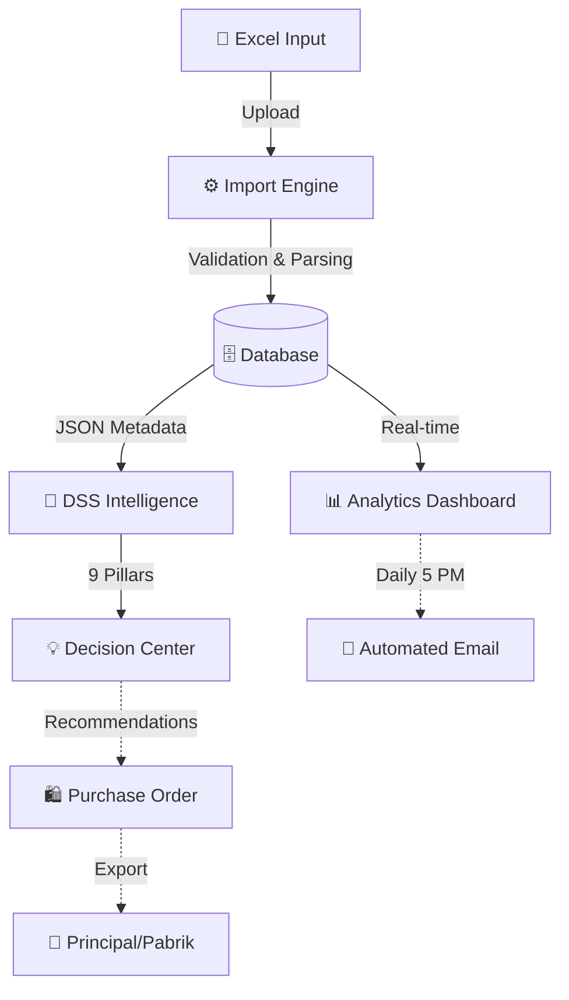

# 📊 Distora Analytics: Enterprise Sales Intelligence System
> Berbasis Laravel 12 & Decision Support System (DSS)

---

## 🚀 I. Pendahuluan
**Distora Analytics** adalah platform analitik tingkat lanjut yang dirancang untuk menjembatani kesenjangan antara data penjualan mentah dan pengambilan keputusan strategis. Dengan fokus pada efisiensi operasional dan intelijen bisnis, sistem ini mengubah ribuan baris data Excel menjadi wawasan yang dapat ditindaklanjuti.

Sistem ini bukan sekadar dashboard visual, melainkan **Pusat Kendali Keputusan** yang membantu pimpinan perusahaan mendeteksi anomali, meramalkan stok, dan memahami perilaku pelanggan secara mendalam.

---

## 🛠️ II. Arsitektur & Teknologi Utama
Distora menggunakan tumpukan teknologi modern untuk memastikan stabilitas dan performa:
- **Framework:** Laravel 12.0 (Teknologi PHP terbaru).
- **Frontend & Visualisasi:** Tailwind CSS & Chart.js (Interaktif & Mobile-Friendly).
- **Database:** MySQL dengan optimasi JSON Metadata untuk fleksibilitas data Excel.
- **Engine Import:** Arsitektur "Chunk-based processing" untuk menangani file Excel besar tanpa membebani memori server.

---

## 💎 III. Modul Core (Inti Sistem)

### 1. Smart Excel Importer
- **Massive Data Handling:** Mampu memproses ribuan baris transaksi dalam hitungan detik.
- **Automated Mapping:** Secara otomatis mengenali Cabang (Banjarmasin, Barabai, Batulicin) berdasarkan format ID transaksi.
- **Data Guard:** Sistem validasi otomatis untuk mencegah data duplikat atau format yang salah masuk ke database.

### 2. Manajemen Periode (Tutup Buku)
- **Data Integrity:** Fitur tutup buku per bulan untuk memastikan laporan masa lalu tidak berubah secara tidak sengaja.
- **Period Isolation:** Memungkinkan filter laporan yang sangat akurat berdasarkan masa promosi atau kuartal tertentu.

### 3. Role-Based Access Control (RBAC)
- **Admin:** Memiliki akses penuh ke seluruh pilar intelijen, manajemen pengguna, dan dashboard performa global.
- **Salesman:** Dashboard khusus (Mobile-Optimized) yang terisolasi. Salesman hanya bisa melihat target KPI mereka sendiri, daftar outlet yang mereka cover, dan progres pencapaian % bulanan.

---

## 🧠 IV. Pusat Kendali Keputusan (9 Pilar Intelligence)
Fitur unggulan Distora yang membantu Supervisor dan Manager mengambil keputusan berbasis data (DSS):

1.  **📊 RFM Analysis (Segmentasi Outlet):**
    Mengelompokkan toko menjadi **Sultan** (Loyal & Transaksi Besar), **Gold** (Potensi tinggi), dan **Sleeper** (Beresiko hilang karena jarang order).
2.  **📦 Market Basket (Bundling):**
    Algoritma yang menemukan pola produk yang sering dibeli bersamaan. Sangat berguna untuk program promo *Buy-1-Get-1* atau paket bundling.
3.  **📉 Discount Evaluation:**
    Menganalisis rasio diskon terhadap profit. Memastikan promo pabrikan benar-benar menghasilkan *net sales* yang sehat.
4.  **🕵️ Anomaly & Audit Return:**
    Mendeteksi tingkat retur yang tidak wajar (di atas 2%) per sales. Alat utama untuk mencegah kecurangan atau masalah kualitas produk di lapangan.
5.  **🔮 Stock Forecasting:**
    Memprediksi sisa hari stok akan habis (Out-of-Stock) berdasarkan kecepatan penjualan harian (*Velocity*). Memberi peringatan "Urgent" jika stok akan habis dlm 1-3 hari.
6.  **🛒 Purchase Optimization (Order Belanja):**
    Simulasi belanja ke pabrik yang mengonversi kebutuhan stok ke dalam satuan **Karton (Ctn)**. Dilengkapi fitur Export Excel untuk langsung dikirim ke Principal.
7.  **🎖️ Principal Intelligence:**
    Laporan 360 derajat untuk satu merk tertentu. Mencakup analisa kota, pertumbuhan 30 hari terakhir, hingga audit retur khusus merk tersebut.
8.  **🧹 Dead Stock Identification:**
    Mengidentifikasi stok yang tidak pernah laku selama 90 hari terakhir. Membantu perusahaan membersihkan modal yang macet.
9.  **📈 Weekly Growth Tracking:**
    Memantau tren pertumbuhan minggu-ke-minggu per pabrikan. Memberikan sinyal cepat jika ada merk yang sedang turun performanya.

---

## 🔄 V. Alur Kerja Sistem (How It Works)
Berikut adalah visualisasi aliran data dalam Distora Analytics:

Berikut adalah penjelasan rinci mengenai siklus hidup data dalam Distora Analytics, dari input hingga menjadi keputusan:

### 1. Fase Input (Data Aggregation)
*   **Excel as Source:** Sistem menggunakan file Excel (`.xlsx`) hasil ekspor dari software distributor (seperti BeeCloud, SAP, atau program POS lokal).
*   **Smart Cleaning:** Saat file diunggah, sistem tidak langsung menelan data. Distora melakukan validasi:
    *   Mengecek kolom yang wajib ada.
    *   Membersihkan karakter aneh.
    *   Mencocokkan ID Produk & ID Outlet agar tidak terjadi data "sampah".
*   **JSON Meta Storage:** Informasi tambahan yang tidak ada di tabel utama (seperti nama Principal, ID Sales, dll) disimpan dalam format JSON. Ini membuat sistem sangat adaptif terhadap perubahan format Excel Principal di masa depan tanpa harus mengubah struktur database.

### 2. Fase Processing (Intelligence Engine)
Setelah data tersimpan, *Engine* Distora bekerja di balik layar:
*   **Automatic Branch Mapping:** Sistem mendeteksi ID transaksi (contoh: `OBM_01`) dan langsung memetakan penjualan tersebut ke Gudang Banjarmasin, Barabai, atau Batulicin secara otomatis.
*   **90-Day Rolling Window:** Untuk pilar DSS (RFM, Dead Stock, dll), sistem selalu mengambil data **90 hari terakhir**. Ini memastikan analisa tetap relevan dengan kondisi pasar terbaru, bukan data yang sudah basi.
*   **KPI Calculation:** Progres % pencapaian target dihitung secara *real-time* setiap kali ada data baru yang masuk.

### 3. Fase Output (Insight Delivery)
Data disajikan melalui 3 saluran utama:
*   **Admin Dashboard:** Visualisasi grafik Chart.js untuk memantau omzet lintas cabang dan performa principal secara makro.
*   **Salesman Mobile Web:** Antarmuka ringan untuk salesman di lapangan guna melihat toko mana yang belum dikunjungi (Sleeper) dan sisa target yang harus dikejar.
*   **Scheduled Automation:** Setiap hari pukul 17.00, server menjalankan "Cron Job" untuk menghitung total omzet hari itu dan mengirimkannya via Email. Anda tidak perlu membuka laptop untuk tahu berapa omzet hari ini.

### 4. Fase Closing (Housekeeping)
*   **Sistem Tutup Buku:** Di akhir bulan, Admin melakukan "Execute Reset" (Tutup Buku).
*   **Archive & Protect:** Data bulan lalu akan dikunci agar laporan keuangan tidak berubah. Target baru untuk bulan depan disiapkan, dan sistem siap menerima unggahan Excel periode berikutnya.

---

## 📧 VI. Otomasi & Reporting
- **Automated Daily Email:** Setiap jam 5 sore, sistem secara otomatis mengirimkan email rekapitulasi performa harian ke Manager (Omzet hari ini, Top Produk, & Sales Achievers).
- **12+ Format Laporan:** Laporan siap pakai mulai dari Top Outlet, Slow Moving Item, hingga Gross vs Net Profit.

---

## 🎯 VI. Nilai Strategis
Dengan menggunakan Distora Analytics, perusahaan beralih dari **"Kira-kira (Guessing)"** menjadi **"Berbasis Data (Data-Driven)"**.
- **Efisiensi Waktu:** Tidak perlu lagi membuat laporan manual di Excel selama berjam-jam.
- **Keamanan Data:** Data tersentralisasi, aman, dan memiliki audit trail yang jelas.
- **Peningkatan Profit:** Melalui optimalisasi stok dan deteksi dini toko-toko yang mulai "tertidur" (Sleeper).

---
*Dokumentasi ini dibuat untuk mempermudah presentasi fitur teknis dan fungsional sistem Distora Analytics.*
